# Как сейчас работает auth в проекте

Этот файл описывает текущую реализацию **регистрации, входа, подтверждения email, OAuth, восстановления пароля, двухфакторной аутентификации (2FA) и авторизации** в папке `server`, чтобы было проще ориентироваться по цепочке вызовов.

## 1) Главная карта файлов

- Точка входа и инфраструктура: `src/main.ts`
- Подключение модулей: `src/app.module.ts`
- HTTP-эндпоинты auth: `src/auth/auth.controller.ts`
- HTTP-эндпоинт подтверждения email: `src/auth/mail-confirmation/mail-confirmation.controller.ts`
- Бизнес-логика auth: `src/auth/auth.service.ts`
- Бизнес-логика подтверждения email: `src/auth/mail-confirmation/mail-confirmation.service.ts`
- Работа с пользователем: `src/user/user.service.ts`
- Guard сессии: `src/auth/guards/auth.guard.ts`
- Guard ролей: `src/auth/guards/roles.guard.ts`
- Комбинированный декоратор авторизации: `src/auth/decorators/auth.decorator.ts`
- Параметр-декоратор текущего пользователя: `src/auth/decorators/authorized.decorator.ts`
- OAuth-реестр провайдеров: `src/auth/provider/provider.module.ts`, `src/auth/provider/provider.service.ts`
- Базовая логика OAuth: `src/auth/provider/services/base-oauth.service.ts`
- Конкретные провайдеры: `src/auth/provider/services/google.provider.ts`, `src/auth/provider/services/yandex.provider.ts`
- Конфиг провайдеров: `src/config/providers.config.ts`
- Конфиг reCAPTCHA: `src/config/recaptcha.config.ts`
- Конфиг SMTP: `src/config/mailer.config.ts`
- Почтовый сервис и модуль: `src/libs/mail/mail.service.ts`, `src/libs/mail/mail.module.ts`
- Шаблоны писем: `src/libs/mail/templates/confirmaton.template.tsx`, `reset-password.template.tsx`, `two-factor-auth.template.tsx`
- Восстановление пароля: `src/auth/password-recovery/password-recovery.controller.ts`, `password-recovery.service.ts`, `password-recovery.module.ts`
- Двухфакторная аутентификация при логине: `src/auth/two-factor-auth/two-factor-auth.service.ts`, `two-factor-auth.module.ts`
- Типизация сессии (`req.session.userId`): `src/express-session.d.ts`
- Модели БД: `prisma/schema.prisma`

---

## Наглядные схемы (Mermaid)

Ниже **блок-схемы** (`flowchart`) показывают ветвления и ошибки; **диаграммы последовательности** (`sequenceDiagram`) — порядок участников и вызовов. В одном документе можно сочетать оба типа. Если Mermaid не рендерится в вашем просмотрщике, код блоков всё равно можно читать как текст.

### Регистрация по email (`POST /auth/register`)

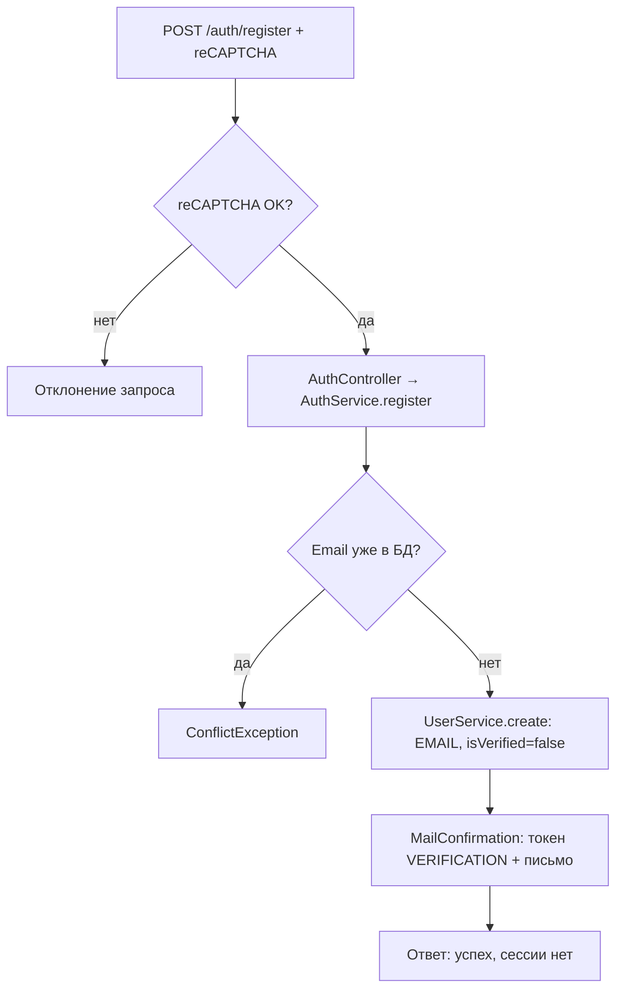

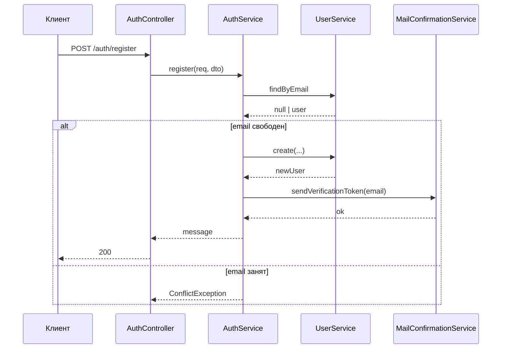

### Подтверждение email (`POST /auth/email-confirmation`)

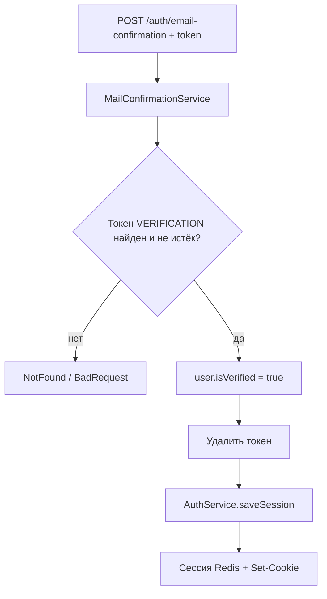

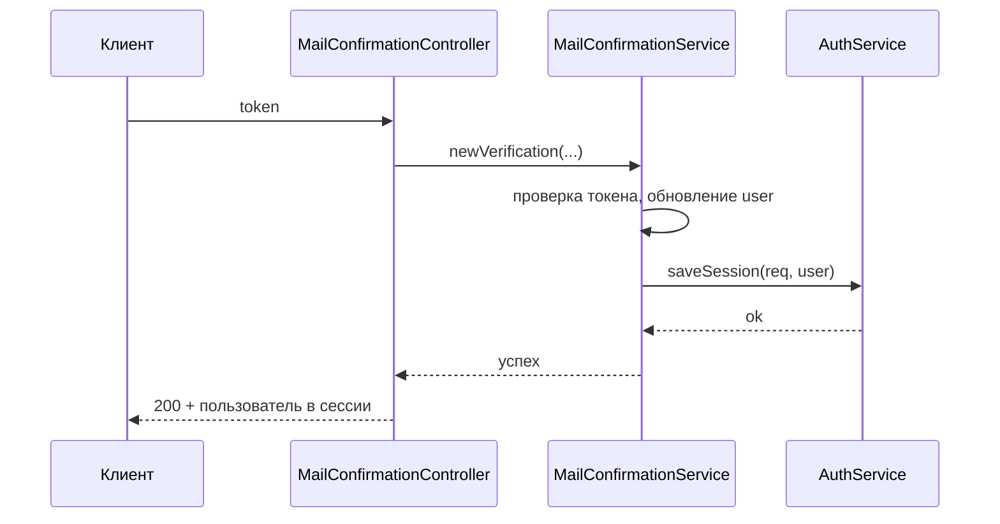

### Логин по email (`POST /auth/login`, включая 2FA)

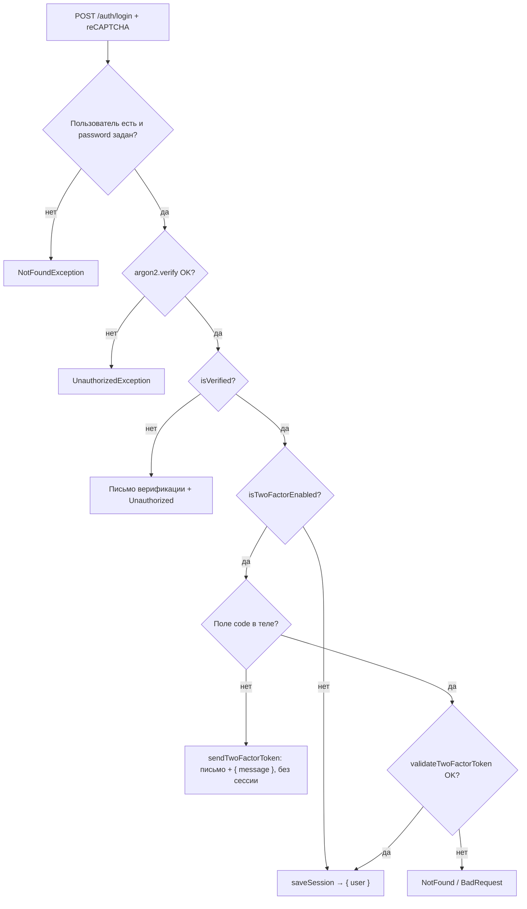

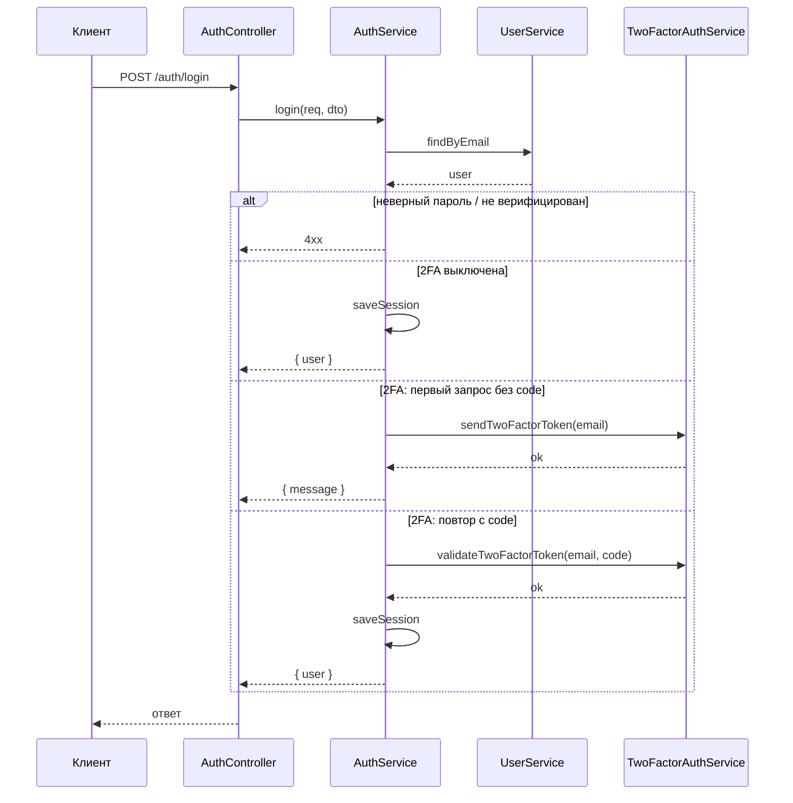

### OAuth2 (старт и callback)

**Старт:** `GET /auth/oauth/connect/:provider` — только выдача URL провайдеру, сессии ещё нет.

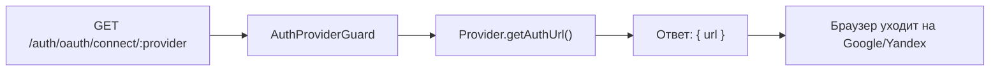

**Callback:** `GET /auth/oauth/callback/:provider?code=...` — обмен кода на профиль, создание пользователя при необходимости, сессия, редирект на фронт. **2FA в этом пути не вызывается.**

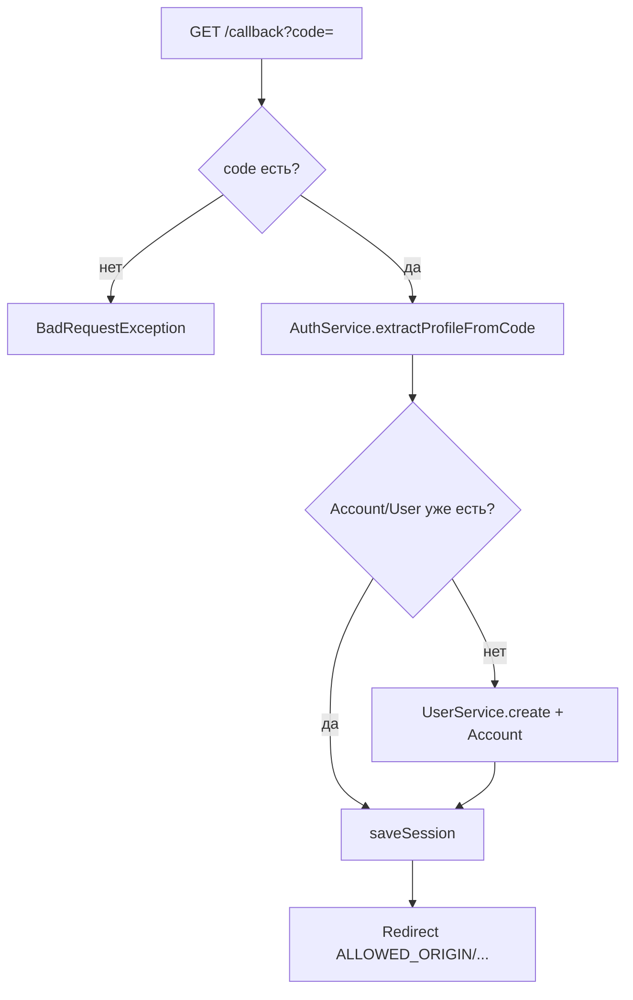

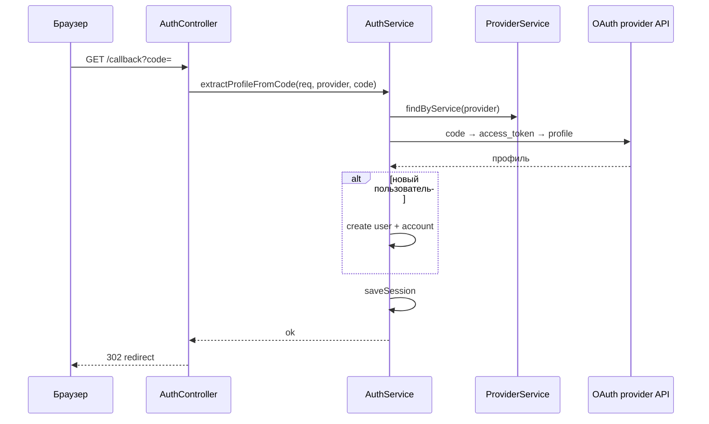

### Восстановление пароля

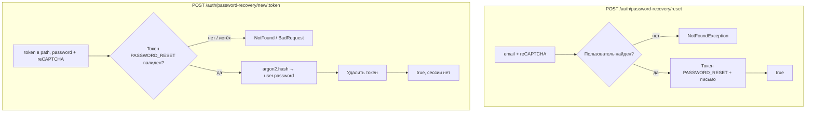

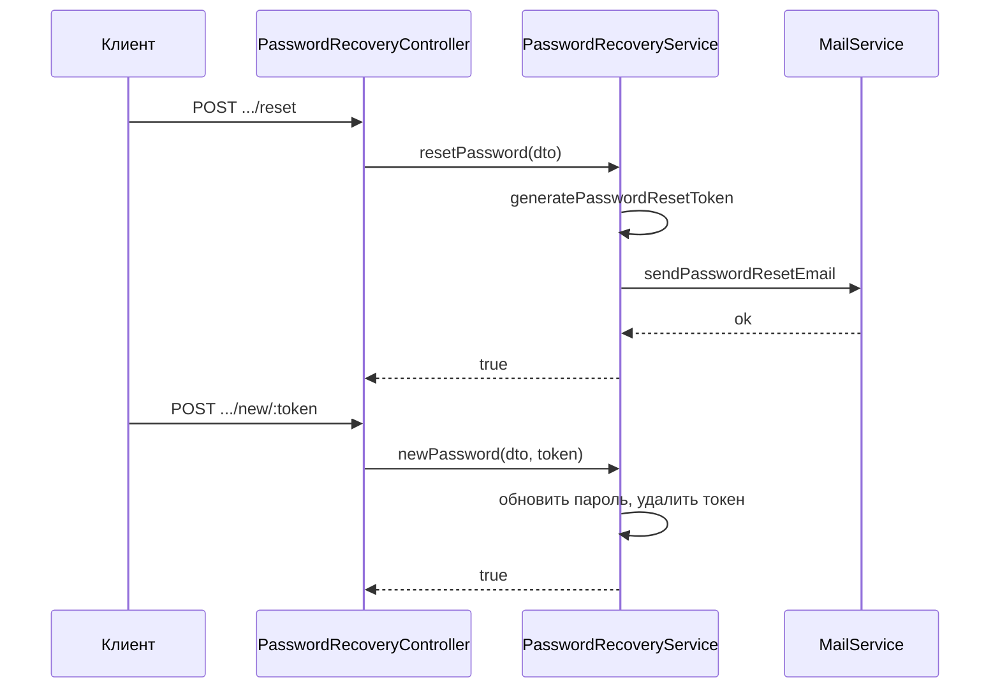

### Авторизация доступа к защищённым маршрутам (после аутентификации)

Аутентификация уже выставила `session.userId`. Декоратор `@Authorization(...)` подключает guard’ы.

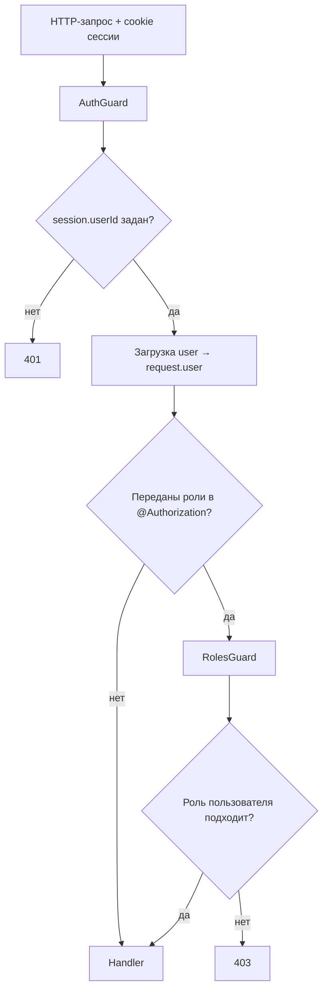

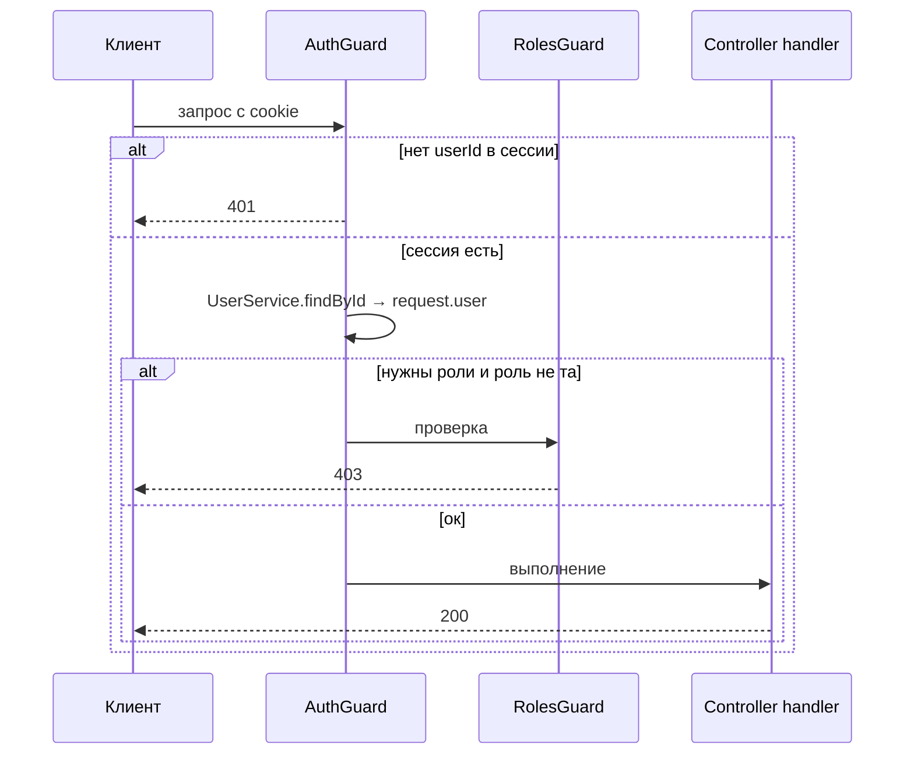

---

## 2) Что происходит при старте сервера

### Шаг 1. Поднимается Nest-приложение
- В `src/main.ts` вызывается `NestFactory.create(AppModule)`.

### Шаг 2. Подключается Redis для хранения сессий
- Там же создаётся `redisClient` и `RedisStore` (`connect-redis`).
- В `app.use(session(...))` настраивается:
  - `SESSION_SECRET`, `SESSION_NAME`
  - cookie-параметры (`domain`, `maxAge`, `httpOnly`, `secure`, `sameSite`)
  - `store: new RedisStore(...)`

### Шаг 3. Включаются CORS, cookie-parser, ValidationPipe
- CORS разрешает запросы от `ALLOWED_ORIGIN` и `credentials: true`.
- Это важно для cookie-сессий между фронтом и бэком.

### Шаг 4. Подключаются модули auth в `AppModule`
- В `src/app.module.ts` импортируются `AuthModule`, `MailConfirmationModule`, `PasswordRecoveryModule`, `TwoFactorAuthModule` (последний также подключён внутри `AuthModule` для `AuthService`).
- В `src/auth/auth.module.ts` регистрируются:
  - `ProviderModule.registerAsync(...)` (OAuth-провайдеры)
  - `GoogleRecaptchaModule.forRootAsync(...)`
  - `MailConfirmationModule` (подтверждение email)
  - `TwoFactorAuthModule` (коды 2FA при входе)

---

## 3) Регистрация по email/паролю (`POST /auth/register`)

Маршрут: `AuthController.register()`

### Цепочка
1. Фронт отправляет `POST /auth/register` с DTO + токеном reCAPTCHA.
2. Декоратор `@Recaptcha()` валидирует токен через `@nestlab/google-recaptcha` (конфиг: `src/config/recaptcha.config.ts`).
3. Контроллер вызывает `AuthService.register(req, dto)`.
4. `AuthService` проверяет email через `UserService.findByEmail`.
5. Если email занят -> `ConflictException`.
6. Иначе `UserService.create(...)`:
   - пароль хешируется через `argon2`
   - создаётся запись в `users` (`authMethod = EMAIL`, `isVerified = false`)
7. `AuthService` вызывает `MailConfirmationService.sendVerificationToken(email)`:
   - генерируется `uuid`-токен подтверждения
   - старый verification-токен для email удаляется (если был)
   - создаётся запись в таблице `tokens` с TTL 1 час (`expiresIn` в секундах)
   - `MailService` рендерит html-шаблон и отправляет письмо через SMTP
8. Клиент получает ответ: регистрация успешна, нужно подтвердить почту.

Итого: регистрация **не создаёт сессию сразу**. Сначала требуется подтверждение email.

---

## 4) Логин по email/паролю (`POST /auth/login`)

Маршрут: `AuthController.login()`

### Цепочка
1. Фронт отправляет `POST /auth/login` + reCAPTCHA токен.
2. `@Recaptcha()` проверяет токен.
3. Контроллер вызывает `AuthService.login(req, dto)`.
4. `AuthService` ищет пользователя по email.
5. Если пользователя нет (или пароль пустой) -> `NotFoundException`.
6. `argon2.verify(...)` сравнивает пароль.
7. Если неверный -> `UnauthorizedException`.
8. Если пароль верный, но `user.isVerified = false`:
   - отправляется новый verification-токен на почту
   - возвращается `UnauthorizedException` с просьбой подтвердить email
9. Если email подтверждён и у пользователя **`isTwoFactorEnabled = false`**: вызывается `saveSession(req, user)`, клиент получает `{ user }`.
10. Если email подтверждён и **`isTwoFactorEnabled = true`**:
    - без поля **`code`** в теле: `TwoFactorAuthService.sendTwoFactorToken(email)` создаёт/обновляет токен типа `TWO_FACTOR` (~5 минут), отправляет письмо с кодом; ответ — объект с `message`, **сессия не создаётся**;
    - с **`code`**: `TwoFactorAuthService.validateTwoFactorToken(email, code)` сверяет код и удаляет токен, затем `saveSession(req, user)` → `{ user }`.

**OAuth** (`extractProfileFromCode`): после успешного профиля провайдера сессия сохраняется сразу, **без** второго шага 2FA в текущем коде.

---

## 5) Восстановление пароля

Префикс: `POST /auth/password-recovery/...` (оба метода с `@Recaptcha()`).

### 5.1 Запрос письма (`POST /auth/password-recovery/reset`)

Маршрут: `PasswordRecoveryController.resetPassword()`

1. Тело: `email` + reCAPTCHA.
2. `PasswordRecoveryService.resetPassword`: пользователь по email; если нет — `NotFoundException`.
3. `generatePasswordResetToken`: удаляется старый `PASSWORD_RESET` для email, создаётся новый `uuid` с TTL ~1 час.
4. `MailService.sendPasswordResetEmail` (шаблон `reset-password.template`).
5. Ответ: `true`.

### 5.2 Новый пароль (`POST /auth/password-recovery/new/:token`)

Маршрут: `PasswordRecoveryController.newPassword()`

1. Path: `token`, тело: `password` + reCAPTCHA.
2. Поиск `tokens` с типом `PASSWORD_RESET`; проверка срока.
3. Обновление пароля пользователя (`argon2.hash`), удаление токена.
4. Ответ: `true` (автовход не выполняется).

---

## 6) Подтверждение email (`POST /auth/email-confirmation`)

Маршрут: `MailConfirmationController.newVerification()`

### Цепочка
1. Фронт отправляет `token` в `POST /auth/email-confirmation`.
2. `MailConfirmationService.newVerification(...)` ищет токен типа `VERIFICATION` в таблице `tokens`.
3. Если токен не найден -> `NotFoundException`.
4. Проверяется срок жизни токена (`expiresIn` хранится в секундах Unix-time).
5. Если токен истёк -> `BadRequestException`.
6. По `email` из токена ищется пользователь.
7. Если пользователь найден:
   - в `users` ставится `isVerified = true`
   - использованный токен удаляется из `tokens`
8. Вызывается `AuthService.saveSession(...)`, пользователь сразу авторизуется.
9. Клиент получает успешный ответ и уже может работать как авторизованный пользователь.

---

## 7) OAuth-авторизация (Google/Yandex)

## 7.1 Старт OAuth (`GET /auth/oauth/connect/:provider`)

Маршрут: `AuthController.connect()`

1. Срабатывает `AuthProviderGuard`:
   - берёт `provider` из `params`
   - через `ProviderService.findByService(provider)` проверяет, что провайдер существует.
2. Контроллер берёт инстанс провайдера.
3. Возвращает `url = provider.getAuthUrl()`.
4. Фронт редиректит пользователя на этот URL.

## 7.2 Callback OAuth (`GET /auth/oauth/callback/:provider?code=...`)

Маршрут: `AuthController.callback()`

1. Проверяется `provider` через `AuthProviderGuard`.
2. Проверяется наличие `code` в query.
3. Контроллер вызывает `AuthService.extractProfileFromCode(req, provider, code)`.
4. `AuthService`:
   - находит провайдер (`ProviderService.findByService`)
   - вызывает `provider.findUserByCode(code)`:
     - POST на `access_url` (обмен `code -> access_token`)
     - GET на `profile_url` (получение профиля)
     - маппинг профиля в `TypeUserInfo` через `extractUserInfo(...)`
5. Дальше `AuthService` ищет связанный аккаунт в таблице `accounts`.
6. Если пользователь найден -> сохраняет сессию и завершает.
7. Если не найден -> создаёт нового пользователя (`authMethod = GOOGLE|YANDEX`, `isVerified = true`) и запись `Account`.
8. Сохраняет сессию (`req.session.userId`) и возвращается в контроллер.
9. Контроллер делает redirect на `${ALLOWED_ORIGIN}/dashboard/settings`.

---

## 8) Что такое «аутентификация» и «авторизация» в этом коде

## Аутентификация (кто ты?)
- `login` (включая при необходимости код 2FA из почты), `oauth callback`, `email-confirmation` подтверждают личность.
- Результат: в сессии есть `userId`.
- Восстановление пароля **не** считается полной аутентификацией: оно только меняет пароль; сессию нужно получить отдельным логином.

## Авторизация (что тебе можно?)
- На защищённых маршрутах ставится `@Authorization(...)`.
- Этот декоратор подключает:
  - `AuthGuard` — проверка, что есть `session.userId`, и загрузка `request.user`
  - (опционально) `RolesGuard` — проверка ролей, если переданы роли в `@Authorization(UserRole.ADMIN)`.

Без ролей: `@Authorization()` -> просто требование авторизации.
С ролями: `@Authorization(UserRole.ADMIN)` -> авторизация + проверка прав.

---

## 9) Как данные лежат в БД

Смотри `prisma/schema.prisma`:

- `User`
  - основной профиль
  - `authMethod` (`EMAIL`, `GOOGLE`, `YANDEX`)
  - `isTwoFactorEnabled` — если `true`, после верного пароля и подтверждённого email требуется код из письма (`TWO_FACTOR`)
  - связь `accounts`
- `Account`
  - oauth-данные: `provider`, `accessToken`, `refreshToken`, `expiresAt`
  - связь на `userId`
- `Token`
  - одноразовые токены: `VERIFICATION` (подтверждение email), `PASSWORD_RESET` (сброс пароля), `TWO_FACTOR` (код при входе)
  - поля: `token`, `email`, `expiresIn`, `type`

---

## 10) Быстрый «трек» запроса по слоям

Универсальная схема:

1. **Controller** принимает HTTP-запрос
2. **Guard/Decorator** (если есть) проверяет доступ
3. **Service** выполняет бизнес-логику
4. **UserService/PrismaService** ходят в БД
5. **Session** сохраняется в Redis + cookie уходит клиенту
6. Следующие запросы читают `session.userId` и восстанавливают пользователя

---

## 11) Почему кажется, что файлов много

Потому что ответственность уже разделена на слои:

- `controller` — только HTTP
- `auth.service` — сценарии входа/регистрации и связка с 2FA
- `provider/*` — изоляция OAuth-логики
- `mail-confirmation/*` — отдельный сценарий подтверждения email
- `password-recovery/*` — сброс пароля по токену
- `two-factor-auth/*` — выдача и проверка кодов 2FA при логине
- `libs/mail/*` — инфраструктура отправки писем
- `guards/decorators` — проверка доступа
- `config/*` — сбор env-конфигурации

Это нормально для Nest-проекта: структура выглядит объёмно, но зато каждый файл отвечает за свою часть цепочки.

---

## 12) Что посмотреть следующим шагом

Чтобы перестать путаться, удобно идти в таком порядке:

1. `src/main.ts` (инфраструктура и сессии)
2. `src/auth/auth.controller.ts` (маршруты регистрации, логина, OAuth, выхода)
3. `src/auth/auth.service.ts` (логин, регистрация, OAuth, сессии)
4. `src/auth/two-factor-auth/two-factor-auth.service.ts` (коды 2FA)
5. `src/auth/password-recovery/password-recovery.service.ts` (сброс пароля)
6. `src/auth/mail-confirmation/mail-confirmation.service.ts` (верификация email)
7. `src/libs/mail/mail.service.ts` + `src/config/mailer.config.ts` (отправка писем)
8. `src/auth/provider/services/base-oauth.service.ts` (общий OAuth)
9. `src/auth/guards/auth.guard.ts` + `src/auth/decorators/auth.decorator.ts` (авторизация доступа)

Если придерживаться этого порядка, почти вся схема в голове быстро складывается.
